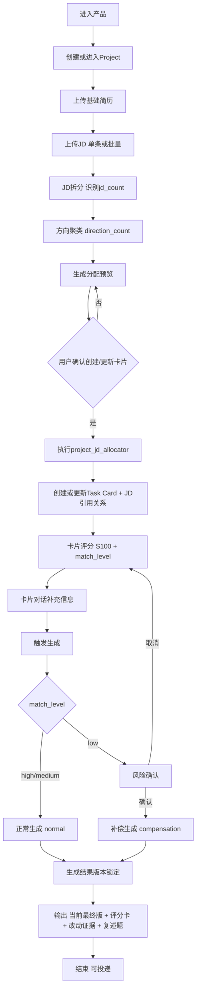
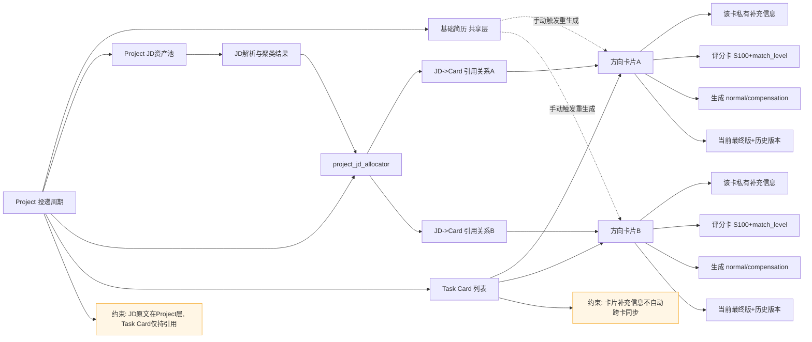

<!--
Input: 当前产品范围、交互约束与实现边界。
Output: 输出产品文档《MVP 需求流程图与信息架构图（v0.3 对齐）》的说明内容。
Pos: 产品设计文档。
Rule: 一旦我被更新，务必同步更新本文件头注释与所属目录 README。
-->
# MVP 需求流程图与信息架构图（v0.3 对齐）

## 用户交互流程（MVP）

```mermaid
flowchart TD
    A["进入产品"] --> B["创建或进入Project"]
    B --> C["上传基础简历"]
    C --> D["上传JD 单条或批量"]
    D --> E["JD拆分 识别jd_count"]
    E --> F["方向聚类 direction_count"]
    F --> G["生成分配预览"]
    G --> H{"用户确认创建/更新卡片"}
    H -- 否 --> G
    H -- 是 --> I["执行project_jd_allocator"]
    I --> J["创建或更新Task Card + JD引用关系"]
    J --> K["卡片评分 S100 + match_level"]
    K --> L["卡片对话补充信息"]
    L --> M["触发生成"]
    M --> N{"match_level"}
    N -- high/medium --> O["正常生成 normal"]
    N -- low --> P["风险确认"]
    P -- 确认 --> Q["补偿生成 compensation"]
    P -- 取消 --> K
    O --> R["生成结果版本锁定"]
    Q --> R
    R --> S["输出 当前最终版 + 评分卡 + 改动证据 + 复述题"]
    S --> T["结束 可投递"]
```

## 产品信息架构（MVP）

```mermaid
flowchart LR
    Project["Project 投递周期"] --> BaseResume["基础简历 共享层"]
    Project --> JDPool["Project JD资产池"]
    Project --> Allocator["project_jd_allocator"]
    Project --> Cards["Task Card 列表"]

    JDPool --> ParsedJD["JD解析与聚类结果"]
    ParsedJD --> Allocator

    Cards --> CardA["方向卡片A"]
    Cards --> CardB["方向卡片B"]

    Allocator --> LinkA["JD->Card 引用关系A"]
    Allocator --> LinkB["JD->Card 引用关系B"]

    LinkA --> CardA
    LinkB --> CardB

    CardA --> MemoryA["该卡私有补充信息"]
    CardA --> ScoreA["评分卡 S100+match_level"]
    CardA --> GenerateA["生成 normal/compensation"]
    CardA --> VersionA["当前最终版+历史版本"]

    CardB --> MemoryB["该卡私有补充信息"]
    CardB --> ScoreB["评分卡 S100+match_level"]
    CardB --> GenerateB["生成 normal/compensation"]
    CardB --> VersionB["当前最终版+历史版本"]

    BaseResume -.手动触发重生成.-> CardA
    BaseResume -.手动触发重生成.-> CardB

    NoteA["约束: JD原文在Project层, Task Card仅持引用"]:::note
    NoteB["约束: 卡片补充信息不自动跨卡同步"]:::note

    Project --> NoteA
    Cards --> NoteB

    classDef note fill:#fff6e5,stroke:#f5a623,color:#333;
```
