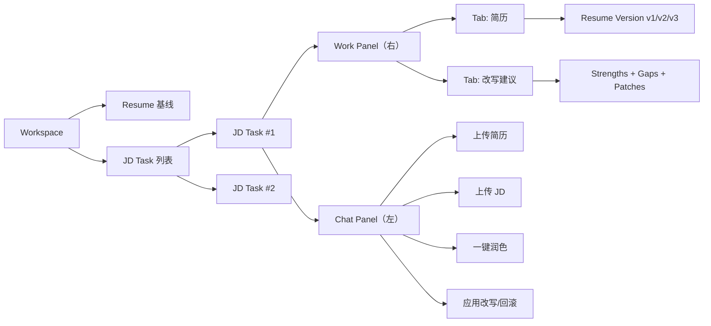
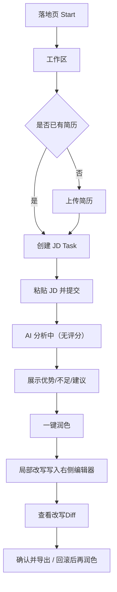
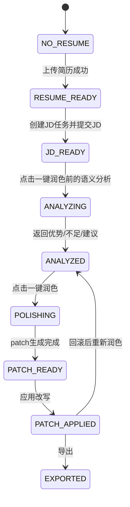
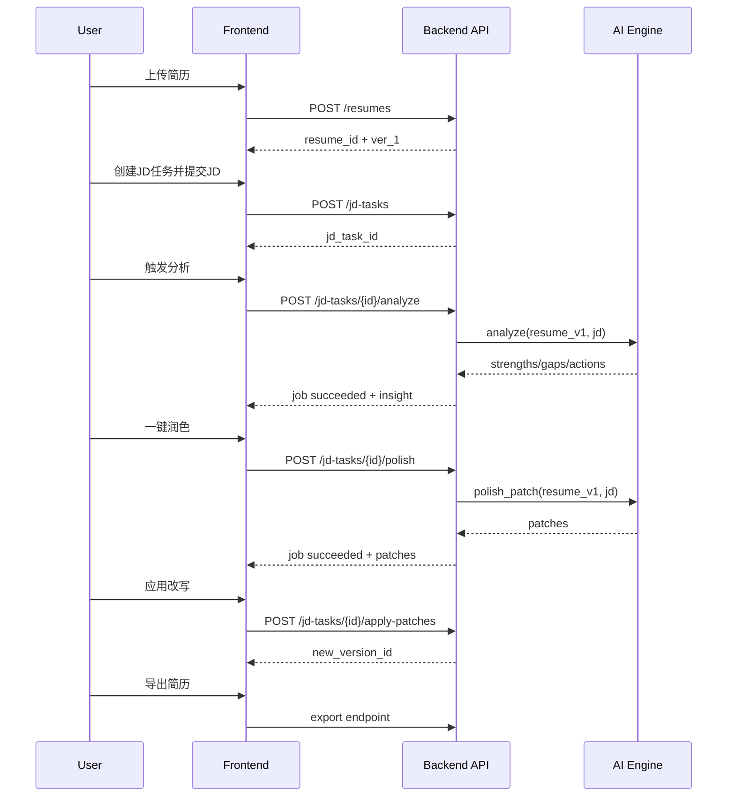

<!--
Input: 当前产品范围、交互约束与实现边界。
Output: 输出产品文档《MVP 最小闭环架构方案（仅润色器 + ATS 适配预留）》的说明内容。
Pos: 产品设计文档。
Rule: 一旦我被更新，务必同步更新本文件头注释与所属目录 README。
-->
# MVP 最小闭环架构方案（仅润色器 + ATS 适配预留）

版本：v1.1  
日期：2026-03-02  
状态：定稿（P0 实施基线，移除内置评分器）

---

## 1. 方案调整结论

## 1.1 核心决策

1. P0 不自研评分器。
2. P0 仅做“简历 JD 局部润色”闭环。
3. 评分能力通过 ATS Provider Adapter 在 P1 接入开源方案。

## 1.2 为什么这样收敛

1. 评分器实现成本高且可被开源方案替代。
2. 用户当前最直接价值是“可用、可改、可导出”的润色结果。
3. 先跑通写入式编辑体验，再接评分能降低返工。

---

## 2. P0 目标与边界

## 2.1 产品目标（P0）

用最小流程完成下面闭环：

1. 上传 1 份简历（基线版本）。
2. 创建 1 个 JD 任务卡并粘贴 JD。
3. AI 生成“优势/不足/改写建议”（无分数）。
4. 用户触发一键润色，AI 仅局部改写并直接写入右侧编辑区。
5. 用户查看改写 diff，确认后导出简历。

一句话定义：

`1 份简历 + N 个 JD 卡片 + 每卡可局部润色 + 可追溯版本`

## 2.2 本阶段不做（明确砍掉）

1. 内置评分模型与分数计算。
2. 复评分数对比（before/after numeric）。
3. ATS 规则自研引擎。
4. 全量整份重写与多模板排版系统。

---

## 3. MVP 信息架构（IA）



---

## 4. 页面流转图（P0）



---

## 5. 前端结构与交互定义

## 5.1 页面布局

1. 顶部：产品导航 + 当前 JD Task。
2. 左侧：对话区（消息流 + 操作按钮）。
3. 右侧：工作区（Tab 切换 `简历` / `改写建议`）。

## 5.2 左侧对话区固定操作

1. `上传简历`
2. `上传 JD`
3. `一键润色`
4. `应用改写`
5. `回滚上个版本`

## 5.3 右侧工作区 Tab

1. `简历`：可编辑正文，patch 应用后高亮显示变更。
2. `改写建议`：展示优势 3-5 条、不足 3-5 条、建议改写 block 列表。

## 5.4 关键交互规则

1. 无简历或无 JD 时，一键润色禁用。
2. 润色过程中按钮防重入。
3. 改写采用 block patch，不可整页覆盖。
4. 每次应用 patch 都产出新 `resume_version`，支持一步回滚。

---

## 6. 前端状态机（P0）



## 6.1 按钮可用性矩阵

| 状态 | 上传简历 | 上传JD | 一键润色 | 应用改写 | 回滚上版 |
|---|---|---|---|---|---|
| NO_RESUME | 可用 | 可用（仅暂存） | 禁用 | 禁用 | 禁用 |
| RESUME_READY | 可用 | 可用 | 禁用 | 禁用 | 禁用 |
| JD_READY | 可用 | 可用 | 可用 | 禁用 | 禁用 |
| ANALYZING | 禁用 | 禁用 | 禁用 | 禁用 | 禁用 |
| ANALYZED | 可用 | 可用 | 可用 | 禁用 | 可用（若有历史） |
| POLISHING | 禁用 | 禁用 | 禁用 | 禁用 | 禁用 |
| PATCH_READY | 可用 | 可用 | 可用 | 可用 | 可用 |
| PATCH_APPLIED | 可用 | 可用 | 可用 | 禁用 | 可用 |

---

## 7. 数据字段结构（核心实体）

## 7.1 `resume`

| 字段 | 类型 | 说明 |
|---|---|---|
| `id` | string(uuid) | 简历主键 |
| `user_id` | string | 用户ID |
| `name` | string | 简历名称 |
| `active_version_id` | string(uuid) | 当前激活版本 |
| `created_at` | datetime | 创建时间 |
| `updated_at` | datetime | 更新时间 |

## 7.2 `resume_version`

| 字段 | 类型 | 说明 |
|---|---|---|
| `id` | string(uuid) | 版本ID |
| `resume_id` | string(uuid) | 所属简历 |
| `version_no` | int | 版本号（1,2,3...） |
| `content_json` | json | 结构化简历内容（section/block） |
| `source` | enum | `upload/manual/ai_patch/rollback` |
| `parent_version_id` | string(uuid) | 上一个版本 |
| `change_summary` | json | 改写摘要 |
| `created_at` | datetime | 创建时间 |

## 7.3 `jd_task`

| 字段 | 类型 | 说明 |
|---|---|---|
| `id` | string(uuid) | 任务卡ID |
| `resume_id` | string(uuid) | 关联简历 |
| `title` | string | 卡片标题（岗位/公司） |
| `jd_text` | text | JD正文 |
| `status` | enum | `draft/analyzing/analyzed/polishing/patch_ready/completed/failed` |
| `current_resume_version_id` | string(uuid) | 当前编辑版本 |
| `latest_insight_id` | string(uuid) | 最近一次分析结果 |
| `created_at` | datetime | 创建时间 |
| `updated_at` | datetime | 更新时间 |

## 7.4 `analysis_insight`

说明：替代评分报告，输出非数值化匹配洞察。

| 字段 | 类型 | 说明 |
|---|---|---|
| `id` | string(uuid) | 洞察ID |
| `jd_task_id` | string(uuid) | 所属任务卡 |
| `resume_version_id` | string(uuid) | 对应简历版本 |
| `strengths` | json array | 优势 3-5 条 |
| `gaps` | json array | 不足 3-5 条 |
| `actions` | json array | 可执行建议 3-5 条 |
| `created_at` | datetime | 创建时间 |

## 7.5 `polish_patch`

| 字段 | 类型 | 说明 |
|---|---|---|
| `id` | string(uuid) | patch ID |
| `jd_task_id` | string(uuid) | 所属任务卡 |
| `resume_version_id` | string(uuid) | 被改写版本 |
| `target_block_id` | string | 目标 block |
| `old_text` | text | 原文 |
| `new_text` | text | 改写后 |
| `reason` | string | 改写原因 |
| `potential_score` | float | 改写潜力分 |
| `applied` | bool | 是否已写入 |
| `created_at` | datetime | 创建时间 |

## 7.6 `ats_assessment`（P1 预留）

| 字段 | 类型 | 说明 |
|---|---|---|
| `id` | string(uuid) | 评估记录ID |
| `jd_task_id` | string(uuid) | 所属任务卡 |
| `resume_version_id` | string(uuid) | 评估版本 |
| `provider` | string | ATS 提供方 |
| `raw_result_json` | json | 原始结果 |
| `normalized_result_json` | json | 标准化结果 |
| `created_at` | datetime | 创建时间 |

## 7.7 `chat_message`

| 字段 | 类型 | 说明 |
|---|---|---|
| `id` | string(uuid) | 消息ID |
| `jd_task_id` | string(uuid) | 任务卡上下文 |
| `role` | enum | `user/assistant/system` |
| `content` | text | 消息内容 |
| `metadata` | json | 附件/动作 |
| `created_at` | datetime | 创建时间 |

---

## 8. 润色器逻辑与工程实现（P0 核心）

## 8.1 设计原则

1. 只输出可直接替换的段落/bullet patch。
2. 只改具备改写潜质的 block。
3. AI 改写结果直接写入右侧编辑器。
4. 禁止整份重写。

## 8.2 实现步骤

1. `结构化切块`：将简历切成 section/block，生成 `block_id`。
2. `语义分析`：结合 JD 输出 strengths/gaps/actions（无分数）。
3. `候选筛选`：按潜力分筛选 Top-K block。
4. `生成 patch`：返回 `old_text/new_text/reason`。
5. `前端写入`：按 block_id 覆盖并高亮。
6. `版本快照`：生成新 `resume_version`，支持回滚。

## 8.3 改写潜力分（建议）

```text
potential_score =
0.40 * jd_gap_relevance
+ 0.25 * quantification_gap
+ 0.20 * weak_action_verb
+ 0.15 * verbosity_penalty
```

## 8.4 安全约束

1. 禁止虚构公司/岗位/时间线。
2. 禁止捏造未出现过的数据。
3. 若需要新增数字，必须来自用户补充或原文证据。
4. 单条改写长度变化建议不超过 ±30%。

---

## 9. ATS 集成架构（P1 预留，P0 不实现）

## 9.1 适配器接口

```text
interface AtsProviderAdapter:
  evaluate(resume_text, jd_text) -> provider_raw_result
  normalize(provider_raw_result) -> normalized_result
```

## 9.2 适配器分层

1. Provider SDK/API 层：调用具体开源 ATS。
2. Adapter 层：统一输入输出格式。
3. Domain 层：把结果挂到 `ats_assessment`。
4. UI 层：读取标准化结果展示在“评估结果”卡片。

## 9.3 接入原则

1. P0 不依赖 ATS 也能完成核心润色闭环。
2. P1 可无痛接入，不改前端主流程。
3. 任何 Provider 不稳定时，不影响润色主链路。

---

## 10. API 设计（P0）

约定：

1. 统一前缀：`/api/v1`
2. 润色流程采用异步任务（返回 `job_id`）
3. `job_status`: `queued/running/succeeded/failed`

## 10.1 上传简历

`POST /api/v1/resumes`

响应：

```json
{
  "resume_id": "res_xxx",
  "active_version_id": "ver_1",
  "name": "Alex_Resume.pdf"
}
```

## 10.2 创建 JD 任务卡

`POST /api/v1/jd-tasks`

请求：

```json
{
  "resume_id": "res_xxx",
  "title": "Senior Frontend Engineer @ Company A",
  "jd_text": "..."
}
```

响应：

```json
{
  "jd_task_id": "task_xxx",
  "status": "draft"
}
```

## 10.3 语义分析（优势/不足/建议）

`POST /api/v1/jd-tasks/{jd_task_id}/analyze`

请求：

```json
{
  "resume_version_id": "ver_1"
}
```

响应：

```json
{
  "job_id": "job_analyze_xxx",
  "status": "queued"
}
```

## 10.4 一键润色（生成 patch + 新版本）

`POST /api/v1/jd-tasks/{jd_task_id}/polish`

请求：

```json
{
  "resume_version_id": "ver_1",
  "instruction": "按当前JD一键润色，优先提升可读性与关键词贴合",
  "mode": "patch_only"
}
```

响应：

```json
{
  "job_id": "job_polish_xxx",
  "status": "queued"
}
```

## 10.5 应用 patch（落盘新版本）

`POST /api/v1/jd-tasks/{jd_task_id}/apply-patches`

请求：

```json
{
  "base_resume_version_id": "ver_1",
  "patch_ids": ["pat_1", "pat_2", "pat_3"]
}
```

响应：

```json
{
  "new_resume_version_id": "ver_2",
  "applied_count": 3
}
```

## 10.6 回滚上个版本

`POST /api/v1/jd-tasks/{jd_task_id}/rollback`

请求：

```json
{
  "target_resume_version_id": "ver_1"
}
```

响应：

```json
{
  "active_resume_version_id": "ver_1"
}
```

## 10.7 查询异步任务

`GET /api/v1/jobs/{job_id}`

响应（analyze 成功示例）：

```json
{
  "job_id": "job_analyze_xxx",
  "job_status": "succeeded",
  "result": {
    "insight_id": "ins_xxx",
    "strengths": [{"title": "...", "evidence": "..."}],
    "gaps": [{"title": "...", "impact": "..."}],
    "actions": ["...", "..."]
  }
}
```

响应（polish 成功示例）：

```json
{
  "job_id": "job_polish_xxx",
  "job_status": "succeeded",
  "result": {
    "patches": [
      {
        "patch_id": "pat_1",
        "target_block_id": "exp_techcorp_b1",
        "old_text": "...",
        "new_text": "...",
        "reason": "与JD职责更贴合"
      }
    ]
  }
}
```

## 10.8 获取任务卡详情

`GET /api/v1/jd-tasks/{jd_task_id}`

响应：

```json
{
  "jd_task_id": "task_xxx",
  "status": "patch_ready",
  "current_resume_version_id": "ver_2",
  "latest_insight_id": "ins_xxx",
  "version_history": [
    {"resume_version_id": "ver_1", "source": "upload"},
    {"resume_version_id": "ver_2", "source": "ai_patch"}
  ]
}
```

---

## 11. 页面与接口联动时序（P0）



---

## 12. MVP 验收标准（仅润色器）

1. 用户可在 5 分钟内完成：上传简历 -> 创建 JD -> 分析 -> 一键润色 -> 应用改写 -> 导出。
2. 分析结果必须包含：优势 3-5 条、不足 3-5 条、行动建议 3-5 条。
3. 一键润色必须返回 patch 列表并写入右侧编辑区，禁止整份重写。
4. 用户可查看改写前后文本并按 block 选择应用。
5. 版本链可回滚到上一个版本。
6. 不接 ATS 时，主流程必须可独立运行。

---

## 13. 本文结论（执行口径）

1. P0 聚焦“局部润色器”即可产生可验证价值。
2. 评分能力统一延后到 P1，以 ATS 适配方式接入。
3. 数据模型保留 `ats_assessment` 预留字段，避免后续迁移成本。
4. 当前研发重点是：patch 质量、写入体验、版本可回滚、导出稳定性。

