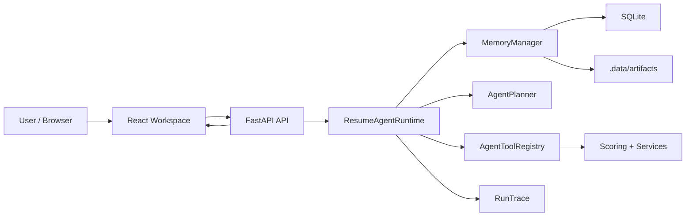

<!--
Input: 当前技术架构、模块边界与工程约束。
Output: 输出技术文档《Architecture》的说明内容。
Pos: 技术设计文档。
Rule: 一旦我被更新，务必同步更新本文件头注释与所属目录 README。
-->
# Architecture

## 1. 一句话架构

当前系统是一个单后端、单前端、单会话运行时的简历工作台：React 前端负责状态可视化与编辑，FastAPI 后端负责 session/message API，`ResumeAgentRuntime` 负责 think-call-observe 主链，SQLite 与 `.data/artifacts/` 负责持久化。

## 2. 模块边界

### 2.1 Frontend

目录：`frontend/`

职责：

1. 创建/恢复 session。
2. 管理 active track、artifact、editor、history 等前端状态。
3. 消费后端 `snapshot / traces / artifacts / score detail`。

### 2.2 API Layer

目录：`src/api/`

职责：

1. 暴露 `/agent/sessions`、`/agent/sessions/{id}/messages` 等主链端点。
2. 暴露 track / JD / profile / experience / artifact 管理端点。
3. 处理上传文件解析与类型识别。

### 2.3 Agent Runtime

目录：`src/agent/`

职责：

1. `runtime.py`：驱动会话生命周期与 trace 落盘。
2. `planner.py`：根据消息内容决定 intent 与 tool steps。
3. `tools.py`：注册 `ingest_jd / track_overview / resume_score / resume_generate / resume_polish`。
4. `memory.py`：维护 profile、experiences、tracks、JD、artifacts 和 dialog summary。

### 2.4 Domain Services

目录：`src/services/`、`src/scoring/`

职责：

1. `JDAnalyzer`：产出 strengths / gaps / actions。
2. `ResumeParser`：把简历拆成 block JSON。
3. `PolishPatcher`：生成 block 级 patch。
4. `ResumeExporter`：导出 markdown 简历文本。
5. `CampusScorerV21`：合成硬分与软分，输出评分报告。

### 2.5 Persistence

目录：`src/db/`

职责：

1. `database.py`：建库、建表、连接。
2. `crud.py`：项目和 JD 的基础仓储。
3. `agent_crud.py`：session、message、profile、track、artifact、trace 等仓储。

### 2.6 Observability

目录：`src/observability/`

职责：

1. 长对话压缩。
2. dialog summary 持久化。
3. 为 memory snapshot 提供近期消息和摘要视图。

## 3. 关键数据对象

1. `Project`：一次投递周期容器。
2. `AgentSession`：一次会话。
3. `CandidateProfile`：候选人结构化画像。
4. `ExperienceItem`：可复用经历资产。
5. `JobTrack`：长期求职方向。
6. `ProjectJDEntry` + `JobTrackJDLink`：JD 资产池与方向绑定关系。
7. `AgentArtifact`：评分、生成、润色和编辑产物。
8. `RunTrace`：intent / thought / tool_call / observation 轨迹。

## 4. 请求链路

主链顺序：

1. 前端发消息到 `/agent/sessions/{session_id}/messages`。
2. runtime 先落消息并更新 memory。
3. planner 产出 intent 与 steps。
4. runtime 顺序执行工具，并记录 `thought / tool_call / observation`。
5. memory 生成最新 snapshot。
6. API 把 reply、snapshot、tool_steps、traces 返给前端。

## 5. 文件系统与数据落点

### 5.1 SQLite

默认路径：`.data/resume_agent.db`

用途：

1. 结构化状态持久化。
2. 会话与消息历史。
3. artifact 元数据与 trace 索引。

### 5.2 Artifact 文件

默认路径：`.data/artifacts/<project_id>/`

子目录：

1. `jd/`
2. `resume/`
3. `state/`
4. `agent/outputs/`

## 6. 当前技术债

1. `src/tools/` 目前只是包占位，真实工具注册在 `src/agent/tools.py`。
2. 评分器仍带有可选 LLM 客户端分支，部署时需要更清楚的环境变量策略。
3. 前端与后端都已收敛到单工作台主链，但评测和历史研究材料仍较多，需继续与主线隔离。
4. 文档和历史设计稿已按 active/reference/archive 分层，但仍需要持续维护边界。

## 7. 部署边界

1. 后端可以通过 `resume_agent serve` 启动。
2. 前端使用 Vite 构建并以静态站点部署。
3. 后端运行需要可写 `.data/` 目录。
4. 生产部署建议前后端分离：前端上 Vercel，后端上 Render。
