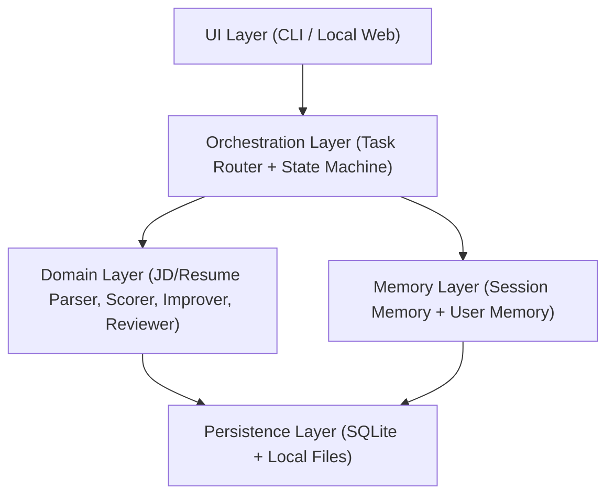

<!--
Input: 当前技术架构、模块边界与工程约束。
Output: 输出技术文档《本地优先部署与 Memory 规划》的说明内容。
Pos: 技术设计文档。
Rule: 一旦我被更新，务必同步更新本文件头注释与所属目录 README。
-->
# 本地优先部署与 Memory 规划

版本：v0.2  
日期：2026-02-27  
关联文档：MVP_PRD_Resume_Fit_Agent.md、ARCHITECTURE.md、任务路由设计.md

---

## 1. 目标与边界

### 1.1 当前阶段目标

1. 项目可在本地一键启动并完成核心流程（解析 -> 评分 -> 路由 -> 生成）。
2. 任何有部署能力的用户可从 GitHub 拉取后本地运行。
3. 数据与状态在本地可追溯，不依赖云端后端服务。

### 1.2 当前阶段不做

1. 多租户线上服务。
2. 跨设备实时同步。
3. 云数据库和对象存储。

---

## 2. 本地优先架构分层



### 2.1 UI Layer

1. `CLI`：用于开发调试和自动化测试。
2. `Local Web`：用于演示和用户交互。

### 2.2 Orchestration Layer

1. 负责意图识别、任务卡状态流转、工具调用顺序。
2. 每次用户输入先还原项目状态，再执行路由。
3. JD 接入统一写入 `Project`，再由 `project_jd_allocator` 做卡片分配。

### 2.3 Domain Layer

1. `jd_parser`
2. `resume_parser`
3. `scorer`
4. `improver`
5. `reviewer`

### 2.4 Persistence Layer

1. 结构化数据：`SQLite`
2. 原始文件与导出产物：本地文件系统

---

## 3. 本地存储规划（核心）

## 3.1 存储目录建议

```text
.data/
  resume_agent.db
  artifacts/
    <project_id>/
      jd/
      resume/
      outputs/
  logs/
```

## 3.2 核心实体

1. `project`：一个求职项目容器。
2. `project_jd_entry`：Project 层 JD 资产（唯一真源）。
3. `task_card`：每个方向一张任务卡。
4. `card_jd_link`：JD 与任务卡引用关系。
5. `jd_allocation_log`：JD 分配决策与理由日志。
6. `artifact_version`：JD/简历不可变版本快照。
7. `run`：一次评分/改写执行记录。
8. `memory_fact`：可变事实（偏好/补充信息/约束）。
9. `message`：聊天消息与操作事件。

## 3.3 设计原则

1. **版本不可变**：JD/简历只新增版本，不覆盖旧版本。
2. **运行可复现**：每个 `run` 绑定输入版本和关键参数。
3. **memory 可更新**：memory 是事实补充层，不替代版本历史。

---

## 4. Memory 规划

## 4.1 Memory 分层

1. `Project Shared Layer`（共享层）  
作用：保存基础简历版本、项目元信息、JD 资产池与分配日志。

2. `Task-Card Private Memory`（卡片私有层）  
作用：保存该方向对话中补充的经历、澄清信息、约束（不存 JD 原文）。

3. `Version Facts`（事实快照）  
作用：保存某个版本下的原始内容和解析结果。  
说明：这部分不属于 memory，属于版本系统。

## 4.2 写入规则

1. 用户上传新简历/JD -> 写入 `artifact_version`。
2. 用户上传 JD -> 先写入 `project_jd_entry`，再执行分配并写入 `card_jd_link`。
3. 用户补充事实信息 -> 写入当前 `task_card` 的 `memory_fact` 并关联 `source_message_id`。
4. 不自动把 `task_card` 补充信息同步到 `project` 共享层或其他卡片。
5. 自动推断信息 -> 标记 `source=agent_inferred` 与 `confidence`，默认不覆盖用户明确输入。

## 4.3 读取规则

每轮执行时按优先级组装上下文：
1. 项目共享层基础简历版本
2. 当前任务卡通过 `card_jd_link` 关联的 Project JD
3. 当前任务相关的 `memory_fact`
4. 最近 N 轮消息摘要

## 4.4 关键本地表建议（新增）

1. `project_jd_entries(project_jd_id, project_id, raw_text, parsed_json, created_at)`
2. `card_jd_links(link_id, project_id, task_card_id, project_jd_id, status, created_at)`
3. `jd_allocation_logs(log_id, project_id, project_jd_id, decision, target_task_card_id, reason, created_at)`

---

## 5. 会话与窗口策略（产品形态）

### 5.1 MVP 建议

1. 默认一个项目一个主会话窗口。
2. 多方向通过任务卡切换，不强依赖多窗口。
3. 新开窗口默认不继承上下文，需显式选择关联项目。

### 5.2 原因

1. 用户心智里“新窗口=新问题”，不适合简历连续优化。
2. 多窗口会带来上下文割裂和状态同步成本。
3. 单窗口 + 任务卡足以覆盖大多数迭代场景。

---

## 6. 长对话的上下文压缩方案

## 6.1 压缩触发

满足任一条件触发压缩：
1. 消息轮次超过阈值（如 30 轮）
2. 上下文 token 接近模型限制

## 6.2 压缩方式

1. 保留最近 N 轮原文（如 8-12 轮）。
2. 较早对话压缩为结构化摘要：
   - 已确认事实
   - 未完成任务
   - 待回答问题
   - 已生成产物索引
3. 摘要必须附带引用（`message_id` / `artifact_version_id`）。

## 6.3 质量护栏

1. 摘要不能改写事实，只能抽取事实。
2. 每次压缩后记录 `summary_version`，支持回溯。
3. 关键事实冲突时，以用户最新明确输入为准。

---

## 7. 本地部署建议（GitHub 可复现）

## 7.1 最小交付

1. `README.md`：本地启动说明。
2. `.env.example`：环境变量示例。
3. `scripts/bootstrap.sh`：初始化依赖和目录。
4. `scripts/dev.sh`：一键启动 CLI 或本地 Web。
5. `scripts/test.sh`：最小回归测试。

## 7.2 运行前提

1. Python 3.11+（或你最终选定版本）
2. Node.js（仅当本地 Web 需要）
3. 可用的模型 API Key（本地环境变量）

---

## 8. 里程碑（本地优先）

1. `M1`：SQLite + 文件存储打通，支持版本快照。
2. `M2`：任务卡状态机与路由跑通。
3. `M3`：评分与改写闭环跑通，输出可追溯结果。
4. `M4`：长对话压缩机制上线。
5. `M5`：本地一键部署文档和脚本完善。

---

## 9. 验收标准

1. 从空目录初始化后，15 分钟内可跑通首个项目。
2. 同一项目可连续迭代 30+ 轮且不丢关键信息。
3. 任意输出可追溯到对应版本、评分和路由决策。
4. 本地关闭重启后，项目状态可完整恢复。
